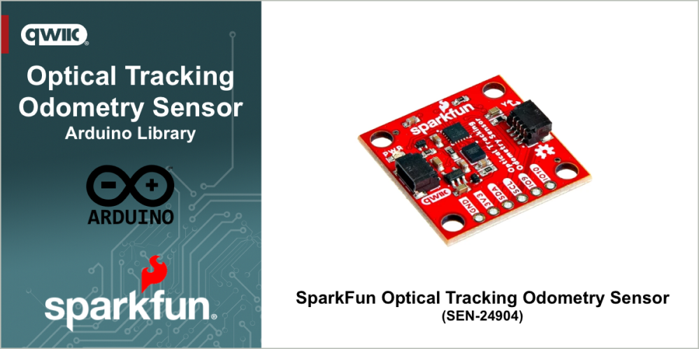

# SparkFun Optical Tracking Odometry Sensor - PAA5160E1

Arduino Library for the SparkFun Optical Tracking Odometry Sensor - PAA5160E1 Sensor

The [SparkFun Optical Tracking Odometry Sensor - PAA5160E1 (SEN-24904)](https://www.sparkfun.com/sparkfun-optical-tracking-odometry-sensor-paa5160e1-qwiic.html)  empowers you to elevate your robot's navigation capabilities with exceptional precision and streamlined integration. This compact, all-in-one sensor leverages the power of the PAA5160E1 chip from PixArt Imaging Inc., delivering accurate dual-axis motion data across various hard floor surfaces. But that's not all! This sensor boasts a powerful built-in 6-axis Inertial Measurement Unit (IMU) and an onboard microcontroller that performs real-time sensor fusion and tracking algorithms.

Looking for the board that matches this library - pick up a [SparkFun Optical Tracking Odometry Sensor - PAA5160E1 (SEN-24904)](https://www.sparkfun.com/sparkfun-optical-tracking-odometry-sensor-paa5160e1-qwiic.html) at www.sparkfun.com.

## Functionality

This library provides an interface that enables the following functionality when a SparkFun Optical Tracking Odometry Sensor - PAA5160E1 Sensors:

* ***TODO***
* 

## General Use

***TODO***

## Examples

The following examples are provided with the library

- [Basic Readings](examples/Example1_BasicReadings/Example1_BasicReadings.ino) - This example demonstrates how to read the position and heading from the SparkFun Qwiic Optical Tracking Odometry Sensor (OTOS).
- [Set Units](examples/Example2_SetUnits/Example2_SetUnits.ino) - This example demonstrates how to change the units of the SparkFun Qwiic Optical Tracking Odometry Sensor (OTOS).. 
- [Calibration](examples/Example3_Calibration/Example3_Calibration.ino) - This example demonstrates how to calibrate the SparkFun Qwiic Optical Tracking Odometry Sensor (OTOS)..
- [Set Offset and Position](examples/Example4_SetOffsetAndPosition/Example4_SetOffsetAndPosition.ino) - This example demonstrates how to set the offset and position of the SparkFun Qwiic Optical Tracking Odometry Sensor (OTOS).
-[Velocity and Acceleration](examples/Example5_VelocityAndAcceleration/Example5_VelocityAndAcceleration.ino) - This example demonstrates how to read the velocity and acceleration from the SparkFun Qwiic Optical Tracking Odometry Sensor (OTOS).
- [Standard Deviation](examples/Example6_StandardDeviation/Example6_StandardDeviation.ino) - This example demonstrates how to read the standard deviation of the measurements of the SparkFun Qwiic Optical Tracking Odometry Sensor (OTOS).
- [Get Version](examples/Example7_GetVersion/Example7_GetVersion.ino) - This example demonstrates how to get the hardware and firmware version numbers from the SparkFun Qwiic Optical Tracking Odometry Sensor (OTOS).
- [Self Test](examples/Example8_SelfTest/Example8_SelfTest.ino) - This example demonstrates how to perform a self test of the SparkFun Qwiic Optical Tracking Odometry Sensor (OTOS).

## Documentation

The full API and use documentation for this library is provided [here](https://docs.sparkfun.com/SparkFun_Qwiic_OTOS_Arduino_Library/). For a quick reference, the main methods available in the library are listed [here](https://docs.sparkfun.com/SparkFun_Qwiic_OTOS_Arduino_Library/class_qwiic_o_t_o_s.html).

Curious about the hardware this board works with - visit the SparkFun Optical Tracking Odometry Sensor [hardware repository](https://github.com/sparkfun/SparkFun_Optical_Tracking_Odometry_Sensor).

The ***Hookup Guide*** for the SparkFun Optical Tracking Odometry Sensor is available [here](https://docs.sparkfun.com/SparkFun_Optical_Tracking_Odometry_Sensor).

## License Information

This product is ***open source***!

This product is licensed using the [MIT Open Source License](https://opensource.org/license/mit). 

